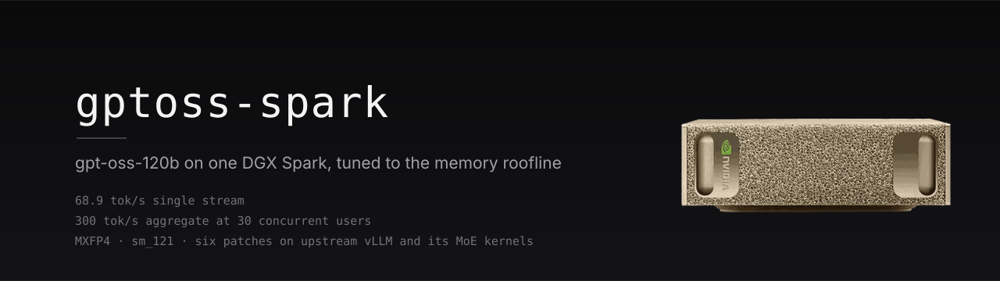

[-1f6feb?style=flat)](docs/SERVING.md)
[](https://huggingface.co/openai/gpt-oss-120b)
[](patches/)
[](LICENSE)

Serving `gpt-oss-120b` on a single NVIDIA DGX Spark (GB10, `sm_121`) at
**65 tokens/s single-stream** and **300 tokens/s aggregate at 30 concurrent
users** — up from 52.6 and 244 on the previously deployed SGLang stack.

The speedup is not a model change and not a different quantization. It is
five small patches on current upstream vLLM, a set of CUTLASS MXFP4 kernels
built for this exact chip, and one non-obvious serving decision
(speculation depth K=1). Every number below was measured on the machine with
the harness in [`bench/`](bench/); every approach that failed is written down
with the same detail as the ones that shipped ([docs/NEGATIVE-RESULTS.md](docs/NEGATIVE-RESULTS.md)).

## 1. Results

One DGX Spark, GB10, 121 GB unified memory, `sm_121`. Identical benchmark for
every row: 4 requests × 512 tokens, single stream, temperature 0, decode
median (`bench/bench.py`). Quality was verified separately, not assumed (§4).

| serving path | decode | TTFT | RAM cap |
| --- | ---: | ---: | ---: |
| SGLang `:spark` (previous production) | 52.6 tok/s | 0.70 s | 96.3 GiB |
| llama.cpp b6fdd0ac, MXFP4 GGUF | 50.4 tok/s | 0.46 s | — |
| stock vLLM nightly (any backend) | 33–35 tok/s | 0.25 s | — |
| **this repo, plain** (`PROFILE=plain`) | **65.0 tok/s** | **0.21 s** | 83 GiB |
| **this repo, speculative K=1** (`PROFILE=spec`) | **68.8 tok/s** | 0.24 s | 83 GiB |

Under concurrent load (`bench/loadtest.py`, N streaming requests at once,
512 tokens each, aggregate = all tokens ÷ makespan):

| concurrent users | | previous (SGLang) | this repo (plain) |
| --- | --- | ---: | ---: |
| 10 | aggregate | 143.5 tok/s | **173.0 tok/s** |
| 10 | until all done | 35.7 s | **29.6 s** |
| 30 | aggregate | 244.1 tok/s | **299.5 tok/s** |
| 30 | TTFT median | 16.4 s | **1.2 s** |
| 30 | until all done | 62.9 s | **51.3 s** |

The 30-user TTFT gap is structural, not noise: the previous stack ran
`--max-running-requests 15`, so half the users waited in a queue while the
other half decoded. This stack admits all 30 immediately and still finishes
the whole round 11.6 s earlier.

## 2. What actually produced the speedup

Ranked by contribution, all measured in isolation:

1. **MXFP4 for the dense layers, not just the experts** (+28 tok/s).
   gpt-oss ships MXFP4 expert weights; `qkv_proj`, `o_proj` and the 201k-row
   `lm_head` stay bf16 in every stock path. Runtime-quantizing them and
   running them through Marlin's fused dequant-GEMM is the single largest
   win — stock vLLM sits at 33–35 tok/s *with* the fast MoE kernels until
   this lands. ([patches/03](patches/03-mxfp4-dense-layers.patch))
2. **SM121-tuned CUTLASS MXFP4 MoE kernels** (+~27 tok/s over Marlin MoE).
   From the [`spark-vllm-mxfp4-docker`](https://github.com/christopherowen/spark-vllm-mxfp4-docker)
   FlashInfer fork, vendored under a separate import name so the engine's own
   FlashInfer (needed for `sm_121` attention) stays untouched.
   ([patches/02](patches/02-spark-cutlass-kernels.patch), [docs/KERNELS.md](docs/KERNELS.md))
3. **Backend selection unblocked** (enables the above).
   Upstream's MXFP4 oracle filters the CUTLASS×MXFP8 variant out on the
   default activation key; three lines re-admit it.
   ([patches/01](patches/01-moe-backend-selection.patch))
4. **Speculation at K=1, with a quantized drafter** (+2.8 tok/s, 62.4 → 65.2).
   Two upstream bugs had to be fixed first for the NVIDIA Eagle3 head to run
   at all ([patches/04](patches/04-gpt-oss-eagle3-aux.patch),
   [patches/05](patches/05-eagle3-draft-quant.patch)). Then the counter-intuitive
   part: K=2 is *slower* than K=1 here. ([docs/SPECULATION.md](docs/SPECULATION.md))
5. **An MoE support kernel that was mostly pointer chasing** (+2.6 tok/s plain,
   +3.1 spec). Two kernels ended with a loop over `alignment × num_experts`
   scale-factor padding slots — 16384 iterations — reloading two
   `expert_first_token_offset` entries from global memory each time. At decode
   batch sizes only a handful of experts are routed to, so over 99 % of those
   iterations wrote nothing. Inverting the loop to run once per expert is
   bit-identical in output and 12–15 µs cheaper per MoE call.
   ([patches/kernels/01](patches/kernels/01-moe-sf-padding-loop.patch))
6. **A draft head that stopped reading 201k rows to propose one token**
   (+0.5 tok/s). NVIDIA's Eagle3 heads ship the full vocabulary and no `d2t`
   table, so each draft step streamed a 307 MB `lm_head`. Cutting it to the
   32768 tokens the target actually emits costs ~1.8 points of acceptance and
   cannot change an answer — the target still verifies over all 201088.
   ([ops/shrink-draft-vocab.py](ops/shrink-draft-vocab.py))

## 3. Where the time goes now

`nsys` over 998 decode passes, CUDA-graph nodes resolved
([docs/KERNELS.md](docs/KERNELS.md)):

| | ms/pass | share | kernels/pass |
| --- | ---: | ---: | ---: |
| MoE expert GEMM | 15.57 | 62.4 % | 72 |
| Marlin dense projections + both lm_heads | 5.62 | 22.5 % | 79 |
| MoE support kernels (expand, activation, strides, finalize, routing) | 2.17 | 8.7 % | 252 |
| Router GEMM (bf16) | 0.75 | 3.0 % | 36 |
| Attention + KV write | 0.52 | 2.1 % | 74 |
| Norms, elementwise | 0.29 | 1.1 % | 174 |

**Kernel time is 24.9 s of a 25 s window — the GPU runs kernels ~100 % of the
time.** There is no host-side stall left to reclaim; earlier claims of a
"12 ms/pass engine overhead" came from a Python profiler that cannot tell
*waiting for the GPU* from *making the GPU wait*, and were refuted three times
over ([docs/NEGATIVE-RESULTS.md §7](docs/NEGATIVE-RESULTS.md)).

The table above is measured *before* the kernel patch in §2.5, and its
per-expert rate is what led an earlier version of this file to claim the MoE
GEMM streams at 76 % of achievable with +10 tok/s left in it. Sweeping the
distinct-expert count one at a time separates the terms:
**≈59 µs fixed per layer + ≈62 µs per expert touched**, and 62 µs for 13.8 MB
is 223 GB/s — **89 % of achievable**. The GEMM is close to the roofline; the
fixed part, 2.1 ms of a 24.6 ms pass across six kernels that move almost no
data, is the lever. §2.5 takes 12–15 µs of it; the router GEMM and three
single-CTA kernels are what remain ([docs/KERNELS.md §3 and §5](docs/KERNELS.md)).

## 4. Quality

The dense-layer quantization in §2.1 is *additional* lossy compression, so it
was verified rather than assumed: 20 prompts (German/English, school subjects,
code, arithmetic), greedy decoding, top-5 logprobs captured from both the
previous production stack and this one (`bench/quality_capture.py`,
`bench/quality_compare.py`).

Result: answers are semantically equivalent; auto-graded arithmetic and
algebra items score 4/5 on both stacks (both miss the same raw
multiplication). Token streams diverge early at near-tie logits — expected
and unavoidable once weights differ — so exact logit identity is not a
meaningful gate here; answer-level agreement is.

## 5. Quickstart

Requires a DGX Spark (GB10, `sm_121`), Docker with the NVIDIA runtime, the
gpt-oss-120b MXFP4 checkpoint, and ~90 GB of free memory. The checkpoint is
not part of the image.

```bash
docker run --gpus all --network host --ipc host --shm-size 32g \
  -v /srv/models/gpt-oss-120b:/model:ro \
  -v /srv/tiktoken:/tiktoken:ro \
  -v gptoss-jit:/root/.cache/flashinfer \
  -e PROFILE=plain ghcr.io/luka-loehr/gptoss-spark:0.1.0
```

`PROFILE=plain` serves many users (32 slots, 300 tok/s aggregate at 30);
`PROFILE=spec` is the single-user record (69 tok/s) and additionally needs the
Eagle3 head mounted at `/eagle`. Full matrix: [docs/SERVING.md](docs/SERVING.md).

> The published `0.1.0` image predates the kernel patch in §2.5 and the draft
> vocabulary tool in §2.6, so it serves 65.2 / 62.4 tok/s, not 68.8 / 65.0.
> Build from this tree (`ops/publish-ghcr.sh`) for the current numbers; the
> next tagged image will include them.

First start JIT-compiles the SM121 kernels (~10 min) — mount the cache volume
shown above and every later start is warm.

### From source

```bash
OWNER=luka-loehr VERSION=0.1.0 ops/publish-ghcr.sh   # build + push, on the Spark
ops/apply-patches.sh                                       # or patch an existing install
bench/bench.py --base-url http://127.0.0.1:8100/v1 --model gptoss \
  --prompts bench/prompts.jsonl --requests 4 --concurrency 1 --max-tokens 512
```

Pinned upstream: vLLM `0.28.1rc1.dev43+g6f7df92a8`, the FlashInfer fork's
kernels (commit in [`containers/Dockerfile`](containers/Dockerfile)), NVIDIA
`gpt-oss-120b-Eagle3-v3`. The patches are diffs against those exact files; a
newer nightly needs them refreshed ([docs/PATCHES.md](docs/PATCHES.md)).

## 6. Documents

- [docs/RESULTS.md](docs/RESULTS.md) — the full measurement campaign, every configuration
- [docs/KERNELS.md](docs/KERNELS.md) — nsys/ncu analysis, roofline accounting, what is left
- [docs/SPECULATION.md](docs/SPECULATION.md) — Eagle3 on a MoE model: the K-sweep, the drafter, the head-retraining attempt
- [docs/NEGATIVE-RESULTS.md](docs/NEGATIVE-RESULTS.md) — 15 approaches that did not work, and why
- [docs/SERVING.md](docs/SERVING.md) — which configuration for which load, and the open items before production
- [docs/PATCHES.md](docs/PATCHES.md) — what each patch changes and which upstream bug it works around

## 7. Attribution

- [vLLM](https://github.com/vllm-project/vllm) (Apache-2.0) — the engine; `patches/` are modifications of its files.
- [christopherowen/spark-vllm-mxfp4-docker](https://github.com/christopherowen/spark-vllm-mxfp4-docker) and the FlashInfer fork it pins — the SM121 CUTLASS MXFP4 kernels. This repository ships no kernel sources, only the build and vendoring recipe.
- [FlashInfer](https://github.com/flashinfer-ai/flashinfer) (Apache-2.0), [CUTLASS](https://github.com/NVIDIA/cutlass) (BSD-3), [NVIDIA gpt-oss-120b-Eagle3-v3](https://huggingface.co/nvidia/gpt-oss-120b-Eagle3-v3) (NVIDIA Open Model License).

Everything original here — patches, benchmark harness, measurement corpus,
documentation — is Apache-2.0.
